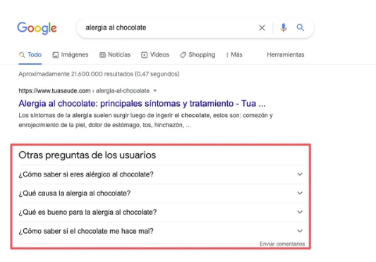
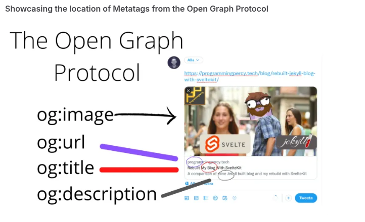

# Meta dados

No html possuimos meta tags, elas fornecem dados sobre o conteúdo  presente na página.

## Relacão entre mecanismos de busca

Isso facilita os buscadores recomendar uma página na busca com base nos dados fornecidos via meta tags.

## Onde fica

Elas ficam localizadas dentro do header do html.

Esta tags não são visiveis no navegador.

## Principais metas tags

- Tag title
  - 1 por pagina
  - max 60 char
  - e o que é exibido nas páginas de busca
  
  
- Tag meta description
  - chars 150 ~ 160
  - como é exibido nos buscadores
  - 
- Tag meta robots
- Tag Open Graph
  - E o card gerado quando compartilhamos uma url da página.
  - 
- Tag meta keyword
  - palavras chaves esta caindo em desuso.
- **Tag canonical**
  - Serve para informar os buscadores url base.
  - Evita multiplo rankeamento para mesma url com paramentros diferentes.  

 
