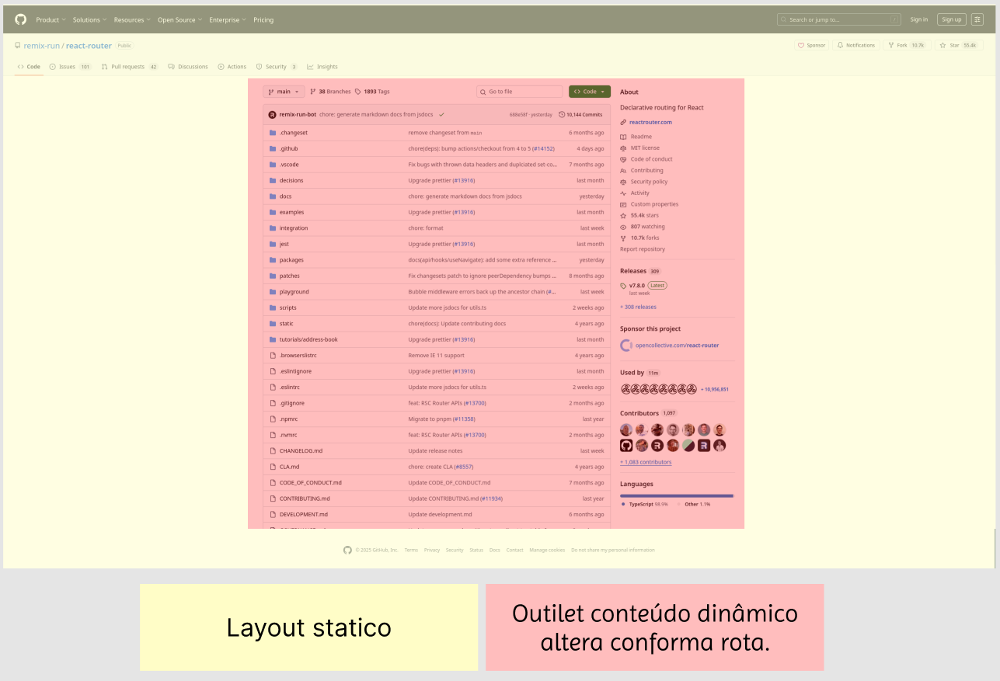

# Modo declarativo

## Indice:

- Intalacao
  
  - configuracao

- Rotas
  
  - Aninhadas
  
  - De Layout
  
  - Índice
  
  - Com prefixo
  
  - Dinâmica
  
  - Links

## Resumo:

**BrowserRouter:**

Seria equivalente ao wrapper global da aplicação onde será gerenciado as rotas.

**Routers:**

Agrupa um conjuto de rotas **Route**.

**Route:**

Gerencia qual rota determinado elemento irá renderizar, com base nos dados definidos em **element** e **path** .

- Element: Componente que sera rederizado.

- Path: rota url

**Outilet:**

Corresponde a um wrapper onde os templates iram ser renderizados como um placeholder.

## Instalação

```shell
npm i react-router
```

Apos instalado react router siga os paços abaixo 

```jsx
import React from "react";
import ReactDOM from "react-dom/client";
import { BrowserRouter } from "react-router";
import App from "./app";

const root = document.getElementById("root");

ReactDOM.createRoot(root).render(
  <BrowserRouter>
    <App />
  </BrowserRouter>,
);
```

- import no entrepoint da sua aplicação react router

- Import o BrowserRouter

- Envolva seu componente root com BrowserRouter

---

## Rotas

### Rota indice index

obs Só é permitido uma por rota pai.

```jsx
<Routes>
  <Route path="/" element={<Root />}>
    {/* renders into the outlet in <Root> at "/" */}
    <Route index element={<Home />} />

    <Route path="dashboard" element={<Dashboard />}>
      {/* renders into the outlet in <Dashboard> at "/dashboard" */}
      <Route index element={<DashboardHome />} />
      <Route path="settings" element={<Settings />} />
    </Route>
  </Route>
</Routes>
```

#### O que é:

Este tipo de rotas serão renderizadas como padrão ao acessar url definida no path.

#### Para o que serve:

Para definir qual template aninhado será carregado dentro de **outlet**, ao acessar a rota definida no Router pai

ex: 

```jsx
 <Route path="dashboard" element={<Dashboard />}>
      {/* renders into the outlet in <Dashboard> at "/dashboard" */}
      <Route index element={<DashboardHome />} />
      <Route path="settings" element={<Settings />} />
 </Route>
```

ao acessar rota **/dashboard** o componente **DashboardHome** sera carredado como padrão. Settings só será carregado caso acesse **/dashboard/settings**

#### Como funciona:

O componente Route deve receber o atributo **index**

```jsx
<Route index element={} />
```

---

### Rotas aninhada:

```jsx
<Routes>
  <Route path="dashboard" element={<Dashboard />}>
    <Route index element={<Home />} />
    <Route path="settings" element={<Settings />} />
  </Route>
</Routes>
```

#### O que é:

Rota aninhada são rotas definidas dentro de uma rota pai. ex **dashboard > settings**

#### Para que server:

Ele foi criada para facilitar a criação e organização de forma declarativa.

#### Como funciona:

Basta criar um elemento Route com path e element dentro de um Route pai, apartir disso vc tera uma extensao da rota pai assim como no bloco de código acima.

---

### Rotas de Layout

```jsx
// App.jsx
import { BrowserRouter, Routes, Route } from 'react-router-dom';
import RootLayout from './RootLayout';
import Home from './Home';
import Sobre from './Sobre';
import Contato from './Contato';

function App() {
  return (
    <BrowserRouter>
      <Routes>
        {/* Rota de layout pai */}
        <Route path="/" element={<RootLayout />}>
          {/* Rotas filhas aninhadas */}
          <Route index element={<Home />} /> {/* Rota padrão (/) */}
          <Route path="sobre" element={<Sobre />} />
          <Route path="contato" element={<Contato />} />
        </Route>
      </Routes>
    </BrowserRouter>
  );
}

export default App;
```

#### Oque é:

Ele é uma forma de renderizar um template pai que envolve outras rotas, mantendo elementos comuns: Bem parecido com os templates do uol article onde só uma parte do template alterava. 

Tipo componente do vue com slot onde o conteudo do slot é dinamico, so que neste caso o elemento slot seria outlet.



#### Para quer serve:

Criar templates maste onde conteúdo statico será definido e o conteudo dinamico relacionado com a rota sera injetado no **outlet** 

#### Como funciona:

O **modo layout** funciona com o componente **Outlet**, será como um placeholder "slot do vue" indicando onde o conteúdo da rota filha será renderizada.

#### Quando usar:

Quando houver uma página que possui conteudos estaticos, ou rota onde o template possui padrão, alterando somente uma parte do layout. Assin como no exemplo da imagem acima.  

---

### Rota com prefixo

#### O que é:

Um agrupamento de rotas que compartilhan o mesmo prefixo de url ex: meudominio.com.br/user

Exemplo conceitual.

```shell
# Conceito.

# user seria o agrupamento
meudominio.com.br/user

# rotas filhas de user
meudominio.com.br/user/login
meudominio.com.br/user/perfil
meudominio.com.br/user/contact
```

#### Pra que serve:

Organizar as rotas visualmente de forma hieraquica.

#### Como funciona:

Na forma declarativa utilizamos o componente Route somente com atributo path indicando a rota de prefixo.

e as rotas especificas de forma aninhada

```jsx
import { BrowserRouter, Routes, Route } from 'react-router-dom';
import Produtos from './Produtos';
import ProdutosLayout from './ProdutosLayout';

function App() {
  return (
    <BrowserRouter>
      <Routes>
        {/* Rota com prefixo "produtos" */}
        <Route path="produtos" element={<ProdutosLayout />}>
          <Route index element={<Produtos />} />           {/* /produtos */}
          <Route path="categoria" element={<Categoria />} /> {/* /produtos/categoria */}
          <Route path="promocao" element={<Promocao />} />   {/* /produtos/promocao */}
        </Route>

        {/* Outro exemplo com prefixo "admin" */}
        <Route path="user">
          <Route index element={<UserPerfil />} />      {/* /user */}
          <Route path="login" element={<Login />} />   {/* /user/login */}
          <Route path="contact" element={<Contact />} /> {/* /user/contact */}
        </Route>
      </Routes>
    </BrowserRouter>
  );
}
```

### Rotas dinâmicas

#### O que é:

Recurso que permite capturar variaveis da URL usando o simbolo : seguido do nome da paramento.

#### Como funciona:

No componente Route no attr path devemos utilizar o simbulo : seguido do nome esperado na url.

ex:

```jsx
/* 
    Ira pegar o paramento id setado na url
    ex url: meudominio.com.br/produto/21
*/

<Route path="produto/:id" element=<ProdutoDetalhe> />
```

#### Exemplo:

```jsx
import { BrowserRouter, Routes, Route } from 'react-router-dom';
import { useParams } from 'react-router-dom';

// Componente que recebe parâmetros dinâmicos
function ProdutoDetalhe() {
  const { id } = useParams(); // Captura o parâmetro da URL

  return (
    <div>
      <h1>Produto ID: {id}</h1>
      <p>Detalhes do produto {id}</p>
    </div>
  );
}

function UsuarioProfile() {
  const { userId, section } = useParams(); // Múltiplos parâmetros

  return (
    <div>
      <h1>Usuário: {userId}</h1>
      <h2>Seção: {section}</h2>
    </div>
  );
}

function App() {
  return (
    <BrowserRouter>
      <Routes>
        {/* Rota dinâmica com um parâmetro */}
        <Route path="produto/:id" element={<ProdutoDetalhe />} />

        {/* Rota dinâmica com múltiplos parâmetros */}
        <Route path="usuario/:userId/:section" element={<UsuarioProfile />} />

        {/* Exemplo mais complexo */}
        <Route path="categoria/:categoriaId/produto/:produtoId" element={<ProdutoCompleto />} />
      </Routes>
    </BrowserRouter>
  );
}
```

### Link

```jsx
import React from 'react';
import { BrowserRouter, Routes, Route, Link, useLocation } from 'react-router-dom';

function Navbar() {
  return (
    <nav style={{ padding: '20px', borderBottom: '1px solid #ccc' }}>
      {/* Link básico */}
      <Link to="/">Home</Link> | 

      {/* Link com replace */}
      <Link to="/sobre" replace>Sobre</Link> | 

      {/* Link passando estado */}
      <Link 
        to="/contato" 
        state={{ origem: 'navbar', timestamp: Date.now() }}
      >
        Contato
      </Link> | 

      {/* Link com estilo CSS */}
      <Link 
        to="/produtos" 
        className="link-especial"
        style={{ color: 'blue', textDecoration: 'none' }}
      >
        Produtos
      </Link>
    </nav>
  );
}

function Contato() {
  const location = useLocation();
  const state = location.state;

  return (
    <div>
      <h2>Página de Contato</h2>
      {state && (
        <p>Você veio da: {state.origem} às {new Date(state.timestamp).toLocaleTimeString()}</p>
      )}
    </div>
  );
}

function App() {
  return (
    <BrowserRouter>
      <Navbar />
      <Routes>
        <Route path="/" element={<div>Home</div>} />
        <Route path="/sobre" element={<div>Sobre</div>} />
        <Route path="/contato" element={<Contato />} />
        <Route path="/produtos" element={<div>Produtos</div>} />
      </Routes>
    </BrowserRouter>
  );
}
```

#### O que é:

Ele é um componente aprimorado tendo como base tag <a> do html.

#### Para que serve:

Para navegar dentro da aplicação sem a necessidade de realizar refresh na página. Segue o conceito de SPA

#### Atributos HTML adicionais

O Link aceita qualquer atributo HTML válido

```jsx
<Link 
  to="/home"
  className="btn-primary"
  target="_blank"
  rel="noopener"
  title="Ir para Home"
>
  Home
</Link>
```

#### Principais vantagens do Link

- **Performance**: Não recarrega a página inteira

- **Estado preservado**: Mantém o estado da aplicação

- **Histórico**: Funciona com botões voltar/avançar do navegador

- **Flexibilidade**: Aceita props personalizadas e atributos HTML[](https://www.geeksforgeeks.org/reactjs/link-component-in-react-router/)

- **Acessibilidade**: Renderiza como `<a>` acessível no DOM

## Hooks

### useSearchParams:

Hook que permite ler ou editar params de pesquisa da URL. 

Ele armazena os dados na própria URL.

```jsx
import { useSearchParams } from 'react-router-dom';

function BuscaProdutos() {
  const [searchParams, setSearchParams] = useSearchParams();

  // Ler parâmetros da URL
  const categoria = searchParams.get('categoria') || 'todos';
  const preco = searchParams.get('preco') || '';

  // Função para atualizar parâmetros
  function filtrarCategoria(novaCategoria) {
    setSearchParams({ 
      categoria: novaCategoria,
      preco: preco // mantém o preço atual
    });
  }

  return (
    <div>
      <h2>Categoria atual: {categoria}</h2>
      <button onClick={() => filtrarCategoria('eletronicos')}>
        Eletrônicos
      </button>
      <button onClick={() => filtrarCategoria('roupas')}>
        Roupas
      </button>
    </div>
  );
}
```

#### Principais métodos do searchParams

- get

- has

- entries

```jsx
function ExemplosSearchParams() {
  const [searchParams, setSearchParams] = useSearchParams();

  // Ler um parâmetro específico
  const busca = searchParams.get('q'); // URL: ?q=notebook

  // Verificar se existe um parâmetro
  const temFiltro = searchParams.has('categoria');

  // Obter todos os parâmetros
  const todosParams = Object.fromEntries(searchParams.entries());

  // Atualizar múltiplos parâmetros
  function aplicarFiltros() {
    setSearchParams({
      q: 'notebook',
      categoria: 'eletronicos',
      ordem: 'preco'
    });
    // Resulta em: ?q=notebook&categoria=eletronicos&ordem=preco
  }

  return <div>{/* ... */}</div>;
}
```
