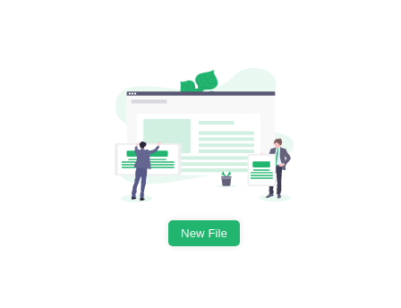

.:
API
ASSETS
CRUD
DBS
DOCKER
FRONTEND - BFF
MONOREPO
REACT
TODO.MD
TYPESCRIPT
WEBPACK

./API:
script.sh
Semana 1 — Introdução, Ambiente e Conceitos Básicos
Semana 2 — Primeiros Passos com Express
Semana 3 — Rotas e Métodos HTTP
Semana 4 — Middlewares e Estrutura do Projeto
Semana 5 — Persistência de Dados
Semana 6 — Validação e Tratamento de Erros
Semana 7 — Autenticação e Segurança
Semana 8 — Testes Básicos e Deploy

./API/Semana 1 — Introdução, Ambiente e Conceitos Básicos:
Conceitos: O que é Node.js, o que é Express, arquitetura REST.md
Criação da pasta do projeto e inicialização com npm init -y.md
Instalar editor de código (VS Code recomendado).md
Instalar Node.js e npm.md

./API/Semana 2 — Primeiros Passos com Express:
Criar arquivo principal (app.js ou index.js).md
Executar e testar localmente no navegador ou Insomnia Postman.md
Implementar servidor básico e rota GET na raiz.md
Instalar o Express: npm install express.md

./API/Semana 3 — Rotas e Métodos HTTP:
Atividade: Criar rotas para um recurso (“produtos”, “usuários”, etc.) com simulação em array.md
Entender request e response.md
Implementar rotas GET, POST, PUT e DELETE.md
Receber e enviar dados em JSON.md

./API/Semana 4 — Middlewares e Estrutura do Projeto:
Atividade: Refatorar API para usar controladores e rotas separadas.md
Estruturar o projeto: separar arquivos de rotas, controllers, models.md
O que são middlewares.md
Usar o express.json() para receber JSON.md

./API/Semana 5 — Persistência de Dados:
Atividade: Persistir dados reais e testar operações.md
Escolher um banco de dados (Ex: MongoDB ou SQLite).md
Instalar dependências (ex: mongoose para MongoDB).md
Integrar banco à API: CRUD completo.md

./API/Semana 6 — Validação e Tratamento de Erros:
Atividade: Simular erros e corrigi-los.md
Implementar validação de dados usando bibliotecas (ex: Joi, express-validator).md
Tratar erros: enviar mensagens apropriadas e status de resposta corretos.md

./API/Semana 7 — Autenticação e Segurança:
Atividade: Criar fluxo de login, registro e acesso restrito.md
Criar rotas protegidas.md
Definir permissões básicas.md
Implementar autenticação com JWT (jsonwebtoken).md

./API/Semana 8 — Testes Básicos e Deploy:
Documentar endpoints usando Swagger ou README.md
Simular deploy local ou em serviços gratuitos (ex: Heroku, Vercel).md
Testes de rotas com ferramentas como Jest ou Supertest.md
Validar funcionamento completo da API.md

./ASSETS:

./CRUD:
script.sh
Semana 1 — Conceitos Básicos e Ambiente
Semana 2 — Projeto e Instalações
Semana 3 — Estrutura da API e Schema Modelo
Semana 4 — Métodos CRUD: CREATE e READ
Semana 5 — Métodos CRUD: UPDATE e DELETE
Semana 6 — Middlewares, Validação e Tratamento de Erros
Semana 7 — Testes, Segurança e Boas Práticas
Semana 8 — Projeto Integração e Deploy

./CRUD/Semana 1 — Conceitos Básicos e Ambiente:
Crie duas pastas: uma para o projeto com MongoDB e outra com PostgreSQL.md
Instale Node.js, VS Code, MongoDB e PostgreSQL.md
Revisão de Node.js, arquitetura REST e diferença entre NoSQL e SQL.md

./CRUD/Semana 2 — Projeto e Instalações:
Configure a conexão básica com ambos os bancos (cluster no Mongo Atlas, database local ou cloud no PostgreSQL).md
Inicialize projetos com npm init -y nos dois ambientes.md
Instale as dependências.md
MongoDB: express, mongoose, dotenv.md
PostgreSQL: express, pg, dotenv (ou sequelize para ORM opcional).md

./CRUD/Semana 3 — Estrutura da API e Schema Modelo:
MongoDB: Crie schema Mongoose para a entidade principal (ex: usuário, produto).md
PostgreSQL: Crie a tabela via SQL ou ORM e modele a entidade.md
PostgreSQL: Organize arquivos: app.js, rotas, controllers, models.md

./CRUD/Semana 4 — Métodos CRUD: CREATE e READ:
Implemente rotas POST (Create) e GET (Read) usando Express:md
MongoDB: Model.create(), Model.find().md
PostgreSQL: comandos SQL ORM INSERT, SELECT.md
Teste os endpoints usando Postman ou Insomnia.md

./CRUD/Semana 5 — Métodos CRUD: UPDATE e DELETE:
Implemente rotas PUT PATCH (Update) e DELETE:md
MongoDB: Model.findByIdAndUpdate(), Model.findByIdAndDelete().md
PostgreSQL: comando SQL ORM UPDATE, DELETE.md
Simule atualizações e remoções nos dois bancos.md

./CRUD/Semana 6 — Middlewares, Validação e Tratamento de Erros:
Adicione validação de dados (ex: com Joi ou validação manual).md
Trate erros e envie respostas apropriadas de status.md
Use express.json() para JSON.md

./CRUD/Semana 7 — Testes, Segurança e Boas Práticas:
Escreva testes básicos para endpoints (ex: com Jest ou Supertest).md
Pratique autenticação básica (ex: JWT, permissões simples).md
Revise padrões REST e boas práticas com manipulação de dados nos bancos.md

./CRUD/Semana 8 — Projeto Integração e Deploy:
Documente endpoints e arquitetura escolhida.md
Escolha um recurso (ex: produtos, tarefas) e elabore CRUD completo nos dois bancos.md
Simule deploy em serviços gratuitos (ex: Heroku, Vercel, MongoDB Atlas).md

./DBS:
script.sh
Semana 1 — Fundamentos de Bancos de Dados
Semana 2 — SQL Básico
Semana 3 — Modelagem Relacional
Semana 4 — SQL Intermediário
Semana 5 — Procedimentos, Views e Índices
Semana 6 — Noções de Administração
Semana 7 — Bancos NoSQL (Introdução)
Semana 8 — Projeto Final

./DBS/Semana 1 — Fundamentos de Bancos de Dados:
Atividade Prática: Instalar um SGBD simples (ex: SQLite) e criar um banco de dados básico.md
Conceitos Básicos: O que é banco de dados, tipos (relacional, NoSQL).md
Modelagem de Dados: Entidades, atributos, relacionamentos.md
SGBDs Populares: MySQL, PostgreSQL, SQLite.md

./DBS/Semana 2 — SQL Básico:
Atividade Prática: Criar e manipular tabelas simples usando SQL.md
Filtros e Ordenação: WHERE, ORDER BY.md
Introdução ao SQL: SELECT, INSERT, UPDATE, DELETE.md
Limite de resultados e operadores: LIMIT, operadores lógicos (AND, OR, NOT).md

./DBS/Semana 3 — Modelagem Relacional:
Atividade Prática: Projetar um modelo para um sistema simples (ex: biblioteca).md
Chaves: Primária, estrangeira, única.md
Diagramas ER: Como desenhar diagramas entidade-relacionamento.md
Normalização: Primeira, segunda e terceira forma normal.md

./DBS/Semana 4 — SQL Intermediário:
Agrupamentos: GROUP BY, HAVING.md
Atividade Prática: Consultas envolvendo múltiplas tabelas e agregações.md
Funções de agregação: SUM, AVG, MIN, MAX, COUNT.md
Joins: INNER JOIN, LEFT JOIN, RIGHT JOIN.md

./DBS/Semana 5 — Procedimentos, Views e Índices:
Atividade Prática: Criar views e índices em tabelas.md
Índices: Como otimizar pesquisas com índices.md
Procedimentos Armazenados: Introdução e exemplos simples.md
Views: O que são e como utilizar.md

./DBS/Semana 6 — Noções de Administração:
Atividade Prática: Realizar backup e restauração de um banco.md
Backup e Restore: Métodos e ferramentas.md
Monitoramento: Ferramentas para acompanhar desempenho.md
Segurança: Permissões de usuário, criptografia básica.md

./DBS/Semana 7 — Bancos NoSQL (Introdução):
Atividade Prática: Instalar e praticar comandos básicos em MongoDB.md
CRUD em NoSQL: Operações básicas.md
Diferenças para Relacional: Quando usar NoSQL.md
Principais Exemplos: MongoDB, Redis.md

./DBS/Semana 8 — Projeto Final:
Ao final de cada semana, revise o conteúdo e pratique exercícios extras.md
Apresentação: Detalhar decisões de modelagem e implementação.md
Dedique ao menos 4h semanais aos estudos (teoria + prática).md
Desenvolvimento: Criação de um banco para um caso real (ex: sistema escolar, e-commerce).md
Dicas complementares:md
Documentação: Modelagem, diagrama, scripts de criação e queries essenciais.md
Use fóruns como Stack Overflow para tirar dúvidas.md
Utilize plataformas online (ex: SQLZoo, DB-Fiddle, MongoDB Atlas) para praticar.md

./DOCKER:
script.sh
Semana 1 — Conceitos Fundamentais e Instalação
Semana 2 — Comandos Básicos e Primeiros Contêineres
Semana 3 — Imagens, Dockerfile e Customização
Semana 4 — Volumes e Persistência de Dados
Semana 5 — Redes e Comunicação entre Containers
Semana 6 — Docker Compose (Orquestração Simples)
Semana 7 — Gerenciamento, Segurança e Deploy
Semana 8 — Projeto Integrador Prático

./DOCKER/Semana 1 — Conceitos Fundamentais e Instalação:
Criar conta no Docker Hub.md
Instalar Docker no seu sistema (Windows, Linux, Mac).md
O que é Docker, containers, imagens e diferença entre máquinas virtuais e containers.md

./DOCKER/Semana 2 — Comandos Básicos e Primeiros Contêineres:
Comandos essenciais: docker run, docker ps, docker stop, docker rm, docker pull, docker images, docker rmi.md
Executar e remover contêineres de imagens públicas (hello-world, nginx, etc).md
Experiência prática rodando aplicações simples.md

./DOCKER/Semana 3 — Imagens, Dockerfile e Customização:
Comandos: docker build, docker tag, docker push.md
Entendendo e usando imagens.md
Escrever o primeiro Dockerfile para criar uma imagem customizada.md
Publicar imagem no Docker Hub.md

./DOCKER/Semana 4 — Volumes e Persistência de Dados:
Comandos: docker volume create, docker volume ls, docker volume inspect.md
O que são volumes, bind mounts e suas utilidades.md
Prática: Montar volumes para persistir dados de aplicações containerizadas.md

./DOCKER/Semana 5 — Redes e Comunicação entre Containers:
Conceitos de redes no Docker: bridge, host, overlay.md
Expor portas dos containers (-p) e conectar múltiplos containers.md
Prática: Rodar dois containers que se comunicam (ex: NodeJS + MongoDB).md

./DOCKER/Semana 6 — Docker Compose (Orquestração Simples):
Escrever e executar docker-compose.yml para aplicações multicontainer.md
O que é e para que serve o Docker Compose.md
Prática: Subir um ambiente com banco de dados e aplicação web.md

./DOCKER/Semana 7 — Gerenciamento, Segurança e Deploy:
Deploy em ambientes de produção básicos (Docker Playground, serviços cloud).md
Gerenciamento de imagens e containers.md
Introdução à segurança: usuários, imagens trusted, boas práticas.md

./DOCKER/Semana 8 — Projeto Integrador Prático:
Compartilhar o projeto e revisar aprendizados.md
Documentar modelo de containers, Dockerfiles e compose.md
Escolher um pequeno sistema (ex: uma aplicação web com backend e banco).md
Publicar imagens no Docker Hub.md

./FRONTEND - BFF:

./MONOREPO:

./REACT:
01 - COMPONENTS
02 - HOOKS
03 - GERENCIAMENTO DE ESTADO
04 - ROTEAMENTO
05 - TESTES
06 - BOAS PRATICAS
07 - PERFORMANCE

./REACT/01 - COMPONENTS:

./REACT/02 - HOOKS:

./REACT/03 - GERENCIAMENTO DE ESTADO:

./REACT/04 - ROTEAMENTO:

./REACT/05 - TESTES:

./REACT/06 - BOAS PRATICAS:

./REACT/07 - PERFORMANCE:

./TYPESCRIPT:

./WEBPACK:
script.sh
Semana 1 — Introdução ao Webpack
Semana 2 — Conceitos Essenciais e Empacotamento
Semana 3 — Loaders: Processando Diferentes Arquivos
Semana 4 — Plugins: Automatizando e Otimizando
Semana 5 — Gerenciamento de Dependências e Módulos
Semana 6 — Ambiente de Desenvolvimento e Produtivo
Semana 7 — Integração com Frameworks e Ferramentas
Semana 8 — Projeto Final

./WEBPACK/Semana 1 — Introdução ao Webpack:
Instalação: Configure o ambiente e instale o Webpack globalmente ou localmente.md
O que é Webpack: Entenda o conceito de bundler de módulos e sua utilidade em projetos modernos.md
Primeira configuração: Crie seu primeiro arquivo de configuração webpack.config.js.md

./WEBPACK/Semana 2 — Conceitos Essenciais e Empacotamento:
Atividade prática: Bundle de arquivos JS simples e análise do resultado.md
Comandos básicos: webpack, webpack-cli, modos de execução (development, production).md
Entradas e Saídas: Como funciona o processo de bundling (entry, output).md

./WEBPACK/Semana 3 — Loaders: Processando Diferentes Arquivos:
Atividade prática: Adicione suporte para CSS e imagens ao projeto via loaders.md
O que são Loaders: A importância de converter arquivos (JSX, TypeScript, CSS, imagens, etc).md
Principais loaders: babel-loader, css-loader, file-loader.md

./WEBPACK/Semana 4 — Plugins: Automatizando e Otimizando:
Atividade prática: Implemente plugins para automação do build.md
O que são Plugins: Diferença entre loaders e plugins.md
Otimizações: Minificação e limpeza de arquivos obsoletos.md
Plugins essenciais: HtmlWebpackPlugin, MiniCssExtractPlugin, CleanWebpackPlugin.md

./WEBPACK/Semana 5 — Gerenciamento de Dependências e Módulos:
Atividade prática: Separar bundles para melhorar performance.md
Importação de módulos: Módulos ES6, CommonJS, tree-shaking.md
Split de código: Divisão do código por rotas ou páginas (code splitting).md

./WEBPACK/Semana 6 — Ambiente de Desenvolvimento e Produtivo:
Atividade prática: Configuração de ambiente dev e build para produção.md
Hot Module Replacement: Atualização automática de módulos.md
Modo development e production: Diferenças e configurações.md
Servidor de desenvolvimento: webpack-dev-server.md

./WEBPACK/Semana 7 — Integração com Frameworks e Ferramentas:
Atividade prática: Configure Webpack com um framework e transpiler.md
Integrando Babel, PostCSS, TypeScript.md

./WEBPACK/Semana 8 — Projeto Final:
Compartilhe: Suba o projeto no GitHub e elabore uma explicação do fluxo de build.md
Desenvolvimento: Escolha uma aplicação simples (ex: landing page ou blog).md
Documentação: Explique suas escolhas de carregadores, plugins e arquitetura de pastas.md

