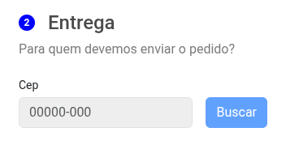

# Criando mascara em inputs


Ex. imagen




Este exemplo é compativel com versão vue3 e compose API


## Instalar a lib.

```shell
npm install imask
```

## Importar lib no projeto.

```js
// importe a lib em seu componente
// import IMask from 'imask'

sintaxe:
IMask(VALOR_INPUT, OPTIONS)


<script setup>
import { ref, onMounted } from 'vue'
import IMask from 'imask'

const inputRef = ref(null)

onMounted(() => {
  if (inputRef.value) {
    IMask(inputRef.value, {
      mask: '00/00/0000',  // mascara que ira ser exibida utilizar 0000
      lazy: false
    })
  }
})
</script>
```

## Como usar.


